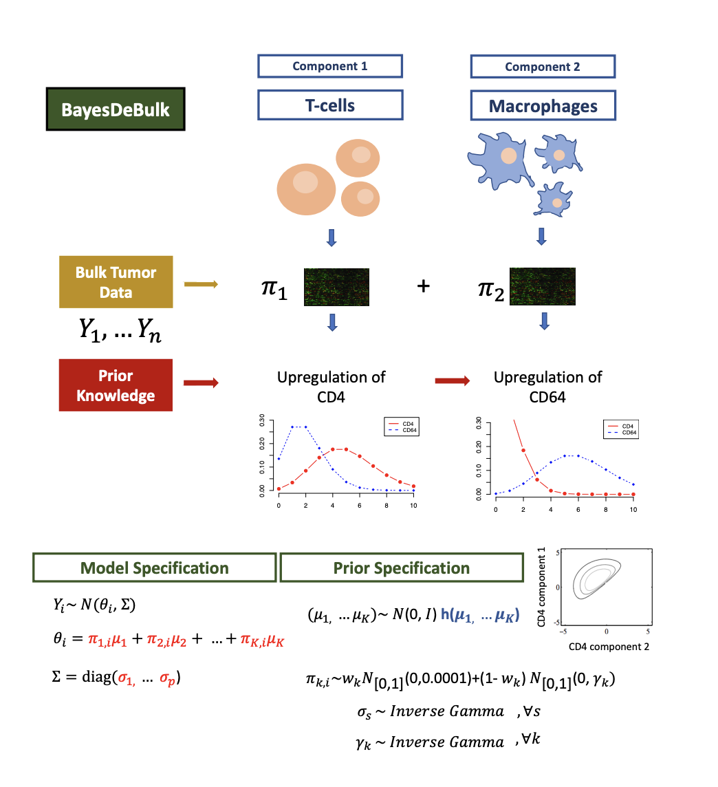

# BayesDeBulk

* [Introduction](#introduction)
* [Citation](#citation)
* [Installing BayesDeBulk package in R](#running-from-the-command-line)
* [Algorithm schematic](#algorithm-schematic)

## Introduction
To understand immune activation and evasion mechanisms in cancer, one crucial step is to characterize the composition of immune and stromal cells in the tumor microenvironment (TME). Deconvolution analysis based on bulk transcriptomic data has been used to estimate cell composition in TME. However, these algorithms are sub-optimal for proteomic data, which has hindered research in the rapidly growing field of proteogenomics. Moreover, with the increasing prevalence of multi-omics studies, there is an opportunity to enhance deconvolution analysis by utilizing paired proteomic and transcriptomic profiles of the same tissue samples. To bridge these gaps, we propose BayesDeBulk, a new method for estimating the immune/stromal cell composition based on bulk proteomic and gene expression data. BayesDeBulk utilizes the information of known cell-type-specific markers without requiring their absolute abundance levels as prior knowledge.

## Citation
For more information, please visit or cite the related preprint: 

[Petralia, F., Calinawan, A. P., Feng, S., Gosline, S., Pugliese, P., Ceccarelli, M., & Wang, P. (2021). BayesDeBulk: A Flexible Bayesian Algorithm for the Deconvolution of Bulk Tumor Data. doi.org/10.1101/2021.06.25.449763](https://www.biorxiv.org/content/10.1101/2021.06.25.449763v4)

## Installing BayesDeBulk package in R 
* Requires R >= 3.6
* Download BayesDeBulk_1.0.tar.gz file
* Install package from command line of R using

  install_packages("BayesDeBulk_1.0.tar.gz")

## Algorithm schematic

Algorithm Schematic. (A) Bulk data is modeled as a linear combination of marker expression in different cell
types. Given a list of markers expressed in each cell type, a Repulsive prior is placed on the mean of marker expression
in different cell types to ensure that cell type specific markers are upregulated in a particular component. (B) Multi-omic
framework to estimate cell type fractions integrating proteomic and RNAseq data. Given a list of cell-type specific markers,
the algorithm returns the estimated protein/RNA expression for different cell types and cell-type fractions for different
samples.
